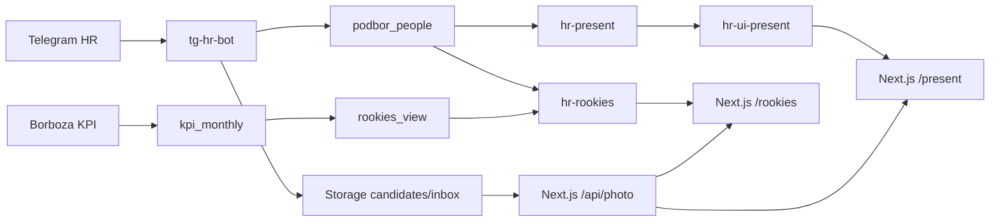

# Архитектура и источники истины

## Два исходника

Production подбора нельзя чинить из одной папки вслепую.

| Зона | Исходник | Ответственность |
|---|---|---|
| HR Control Tower и Edge Functions | `C:\Users\admin\Desktop\HR` | БД, миграции, сборщики, `hr-present`, `hr-ui-present`, `hr-rookies`, `tg-hr-bot` |
| Веб-прокси `hr.tools.rlevelai.ru` | `C:\Users\admin\Desktop\id-tools\podborhhsource\podbor-sso` | маршруты `/present`, `/rookies`, `/p/<token>`, `/api/photo`, auth и Vercel deployment |

Изменение HTML `/present` и `/rookies` обычно делается в Edge Functions этого репозитория и не требует Vercel-деплоя. Изменение маршрута, middleware, auth или `/api/photo` требует сборки и деплоя `podbor-sso`.

## Потоки

## Основные данные

| Объект | Назначение | Важное ограничение |
|---|---|---|
| `public.podbor_people` | карточка человека, ФИО, описание, фото, дата стажировки, связь Borboza | не удалять для визуальных исправлений |
| `public.kpi_monthly` | месячные KPI из Borboza по `external_id` | источник цифр, не источник фотографий |
| `public.rookies_view` | экран новичков и связанная карточка | фото может дополняться уникальным совпадением с презентацией |
| `public.podbor_present_sets` | подборки/презентации | удаление подборки не должно удалять человека |
| `public.podbor_present_items` | состав и порядок подборки | ссылка на человека, а не копия фото |
| `public.podbor_bot_users` | белый список и подписи HR | обычный пользователь не администратор |
| `public.podbor_settings` | закрытые настройки бота и UI | значения не выводить в логи |
| bucket `candidates` | файлы кандидатов | браузер получает фото через `/api/photo` |

## Edge Functions

| Функция | Назначение | Когда деплоить |
|---|---|---|
| `hr-present` | внутренний API людей и подборок | изменение выборки, полей или действий `/present` |
| `hr-ui-present` | HTML и формы `/present` и публичных подборок | изменение карточек, кнопок и обработчиков форм |
| `hr-rookies` | HTML, импорт KPI и сопоставление фото новичков | изменение `/rookies`, парсинга Borboza или matching |
| `tg-hr-bot` | приём фото/описания и доступ Telegram | изменение команд, webhook или создания карточек |

Все четыре функции используют собственную серверную проверку. Их деплоят с `--no-verify-jwt`, потому что Next.js и Telegram не присылают пользовательский Supabase JWT. Это не отменяет внутреннюю проверку кода/webhook secret.

## Где корректировать

| Изменение | Файл/слой |
|---|---|
| Состав активных кандидатов | `supabase/functions/hr-present/index.ts` |
| Кнопки и карточки презентации | `supabase/functions/hr-ui-present/index.ts` |
| KPI и фото новичков | `supabase/functions/hr-rookies/index.ts` и `photo-match.ts` |
| Регистрация HR в Telegram | `supabase/functions/tg-hr-bot/index.ts` и `podbor_bot_users` |
| Отдача файла браузеру | `podbor-sso/app/api/photo/route.ts` |
| Наличие `/present` и `/rookies` | `podbor-sso/app/*/route.ts` |
| Авторизация маршрутов | `podbor-sso` middleware и Yamaguchi ID |
| Схема и RLS | только новая проверенная миграция в `supabase/migrations` |

## Связанные спецификации

- [Досрочный сход кандидата](../features/FEATURE_present_early_exit.md)
- [Сопоставление фото новичков](../features/FEATURE_rookies_photo_matching.md)
- [Инцидент фото и презентации](../../.agents/skills/podbor-hr-support/references/photo-presentation-incident.md)
- [Пользователи Telegram](../../.agents/skills/podbor-hr-support/references/telegram-users.md)
